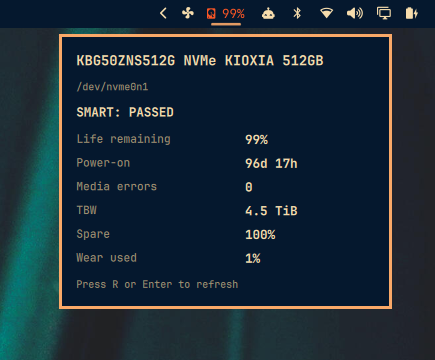

# NVMe Health



SMART disk health for the Omarchy Quattro bar: remaining life, power-on hours, media errors / reallocated sectors, and TBW.

Reads SMART through **UDisks2** (already on Omarchy). No `smartctl`, no root, no sudoers.

## Install

```sh
omarchy plugin add https://github.com/qadram/omarchy-nvme-health.git --enable
```

Or from a local checkout:

```sh
PLUGIN_ID=io.github.qadram.nvme-health
PLUGIN_DIR="$HOME/.config/omarchy/plugins/$PLUGIN_ID"
mkdir -p "$PLUGIN_DIR"
cp -a manifest.json BarWidget.qml Panel.qml Model.js status.py "$PLUGIN_DIR/"
chmod +x "$PLUGIN_DIR/status.py"
omarchy plugin validate "$PLUGIN_DIR"
omarchy-shell shell rescanPlugins
omarchy plugin enable "$PLUGIN_ID" --section right
```

## Usage

- **Left click:** open the details panel
- **Middle click** (bar) or **R / Enter** (panel): refresh
- Bar label: remaining life `%`, or `!` when something looks wrong

## Configure

```sh
omarchy bar move io.github.qadram.nvme-health --section right
```

Optional settings on the widget entry in `~/.config/omarchy/shell.json`:

- `refreshIntervalSec` — 60–3600 (default `300`)
- `device` — e.g. `/dev/nvme0n1` (empty = first NVMe)

## Remove

```sh
omarchy plugin remove io.github.qadram.nvme-health
```

## License

MIT
